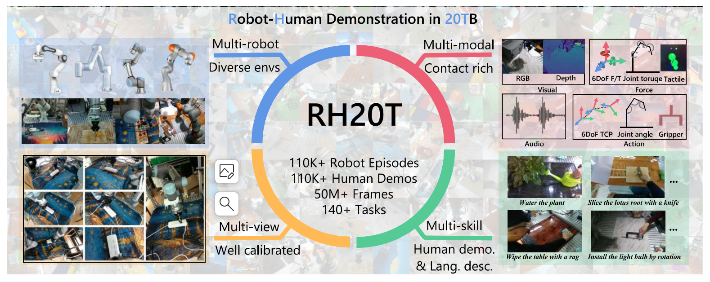

# Datasets for Robotics

### RH20T Dataset

  图1 RH20T数据集概览图

## Reference

[1] Fang H S, Fang H, Tang Z, et al. RH20T: A Comprehensive Robotic Dataset for Learning Diverse Skills in One-Shot[C]//Towards Generalist Robots: Learning Paradigms for Scalable Skill Acquisition@ CoRL2023. 2023.

